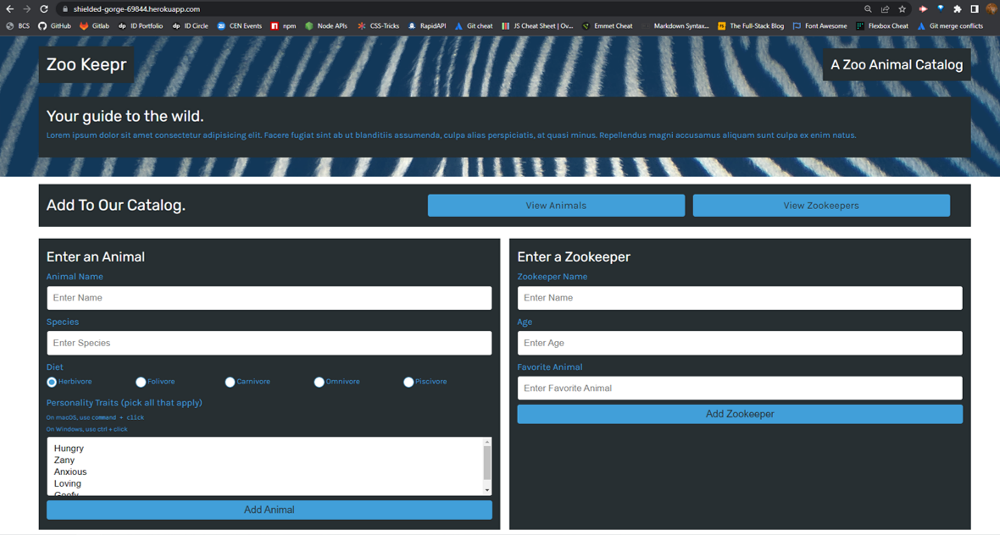

# Zoo Keepr
  
  
  ## Table of Contents
  [Description](#description)  
  [Installation](#installation)   
  [License](#license)    
  [Tests](#tests)  
  [Questions](#questions)
  ## Description
  Zoo Keepr is a front-end application that serves as a digital information management system for a local zoo. This system allows the zoo's administrators to manage operations more effectively while making educational information available to the public online.
  Express.js was used to create the web server for the application. The codebase also includes unit test files.
  The deployed application is available on Heroku at: https://shielded-gorge-69844.herokuapp.com/  
    

  
  ## Installation
  Open the project's repository on GitHub, click the "Code" dropdown button, copy the SSH key, and input 'git clone SSH key' in the terminal in the root directory. This will create a local copy of the application, which you can use.
  ## License
  MIT
  Copyright (c) Anita Jose. All rights reserved. Licensed under the MIT license.
  ## Tests
  Tests were performed using Jest. Use "npm run test" to initialize the tests.
  ## Questions
  Got any questions? Email the author at: [anitajose119@gmail.com](mailto:anitajose119@gmail.com)  
  Author's GitHub profile: [anitajose1](https://github.com/anitajose1)